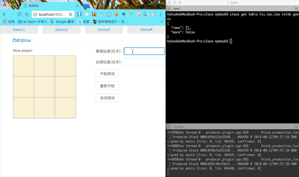

# EOS-Dapp
---
##  1、三连棋游戏
### 示例

说明：基于EOS区块链上的小游戏Dapp 
  * 使用C++开发智能合约,参考contract文件下的docs里的`tic_tac_toe合约手册`
  * 前端使用 React + EOS.js
  * 部署在EOS Dawm4.0.0测试网络上

##  2、发送母亲节祝福
### 示例

说明：基于EOS区块链上的母亲节祝福Dapp 
  * 使用C++开发智能合约,参考contract文件下的docs里的`motherday合约手册`
  * 前端使用 React + EOS.js
  * 部署在EOS Dawm3.0.0测试网络上

##  3、任务便签
### 示例

说明：基于EOS区块链上实现CRUD操作 
  * 使用C++开发智能合约,参考contract文件下的docs里的`todo合约手册`
  * 前端使用 React + EOS.js + Ant-Design +React-Router
  * 部署在EOS Dawm3.0.0测试网络上

## 使用
  本地安装使用 
  环境:Nodejs、Webpack
  * 下载至本地
  * 进入frontend文件夹，执行`npm install` 安装依赖
  * 部署合约，参考contract文件下的docs里的合约手册
  * 终端当前目录下`npm start`启动前端
  * 浏览器localhost:8080端口即可查看

## 其他
[教程发布]
> * [第一篇:Windows环境下Docker搭建EOS环境](https://github.com/PeterHuZQ/EOS-Development/blob/master/Windows%E7%8E%AF%E5%A2%83%E4%B8%8BDocker%E5%AE%89%E8%A3%85EOS%E6%95%99%E7%A8%8B.md)

> * [第二篇:Mac搭建EOS环境](https://github.com/PeterHuZQ/EOS-Development/blob/master/Mac%E4%B8%8B%E6%90%AD%E5%BB%BAEOS%E7%8E%AF%E5%A2%83.md)

> * [第三篇:发币教程](https://github.com/PeterHuZQ/EOS-Development/blob/master/%E5%8F%91%E4%B8%AA%5B%E5%A4%A7%E5%AE%9DSOD%E5%B8%81%5D.md)

> * [第四篇:EOS智能合约第一课：发送母亲节祝福](https://github.com/PeterHuZQ/EOS-Dapp/blob/master/contract/docs/motherday%E5%90%88%E7%BA%A6%E6%89%8B%E5%86%8C.md)

> * [第五篇:EOS智能合约第二课：任务便签](https://github.com/PeterHuZQ/EOS-Dapp/blob/master/contract/docs/todo%E5%90%88%E7%BA%A6%E6%89%8B%E5%86%8C.md)

> * [第六篇:EOS智能合约第三课：三连棋游戏](https://github.com/PeterHuZQ/EOS-Dapp/blob/master/contract/docs/tic_tac_toe%E5%90%88%E7%BA%A6%E6%89%8B%E5%86%8C.md)

未完待续，欢迎学习EOS智能合约的朋友加微信：hu350410796 
