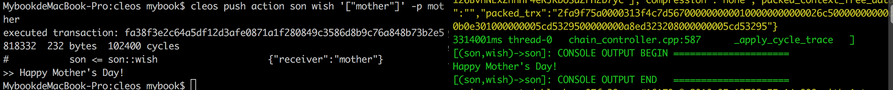

# 如何发布EOS智能合约
---
## 1.eos进阶操作
### 1.1 eos区块链系统的启动升级方式
在上一个实例中，我们通过一长串命令直接启动 nodeos 区块链操作系统：
>cd build/programs/nodeos

>./nodeos -e -p eosio --plugin eosio::wallet_api_plugin --plugin eosio::chain_api_plugin --plugin eosio::account_history_api_plugin

这个操作现在可以升级了——先配置 config.ini ，然后直接运行 nodeos 启动，这样做的好处是配置方面更加的个性化，就像安装软件时的「经典安装」与「自定义安装」的区别。

这个过程很简单，只需要以下步骤：
> * 进入eosio文件夹 
`cd /Users/[用户名]/Library/Application\ Support/eosio/nodeos` 
config是区块链配置文件，data是区块链交易数据、钱包数据存储文件

> * 修改 config.ini文件 
`cd config`  
`vi config.ini` 
你需要做如下设置：
>> * genesis-json = "/Users/[用户名]/Library/Application Support/eosio/nodeos/config/genesis.json"
>> * access-control-allow-origin= *
>> * enable-stale-production = true
>> * producer-name = eosio 
>> * plugin = eosio::producer_plugin
>> * plugin = eosio::wallet_api_plugin
>> * plugin = eosio::chain_api_plugin
>> * plugin = eosio::http_plugin

> * 运行 nodeos,接下来再次启动 
`cd eos/build/programs/nodeos` 
`./nodeos` 
要中断系统的话只要按下 Ctrl + C 就行。

### 1.2 查看并解锁钱包
如果你运行过两次区块链网络会发现这样的情况，第二次运行的时候系统
>`cd eos/build/programs/cleos` 
`./cleos wallet create`

告诉你钱包已经存在,但是使用,查看钱包列表，会看到钱包列表是空的。
>`./cleos wallet list`

这是由于EOS的安全机制导致区块链重新启动后钱包是锁定状态（Locked），这时使用以下代码解锁既能使用，然后输入创建钱包时生成的那串密钥，即能解锁钱包。
>`./cleos wallet unlock -n default` 

## 2.智能合约的加载与运行 
### 2.1 编译智能合约

首先用 cd 命令访问我们cpp文件所在的目录 
`cd eos-dapp/contract/motherday`
>* 然后先通过以下命令编译出 wast 文件： 
`eosiocpp -o motherday.wast motherday.cpp` 
会有 warning ，不过如果没有 error 我们就不用去理它。

>* 然后再通过以下命令编译出 abi 文件： 
`eosiocpp -g motherday.abi motherday.cpp`

### 2.2 部署到本地网络
创建账户 
`cd eos/build/programs/cleos`
> * ./cleos create key
> * ./cleos wallet import [ 生成的私钥 ]
> * ./cleos create account eosio mother [ 生成的公钥 ] [ 生成的公钥 ]
> * ./cleos create account eosio son [ 生成的公钥 ] [ 生成的公钥 ]

加载合约 
执行如下命令，让 son 账户加载 motherday 合约。 
`./cleos set contract son ../motherday`

执行合约 
执行如下命令，son 账户执行 motherday 合约。 
`cleos push action son wish '["mother"]' -p mother`

