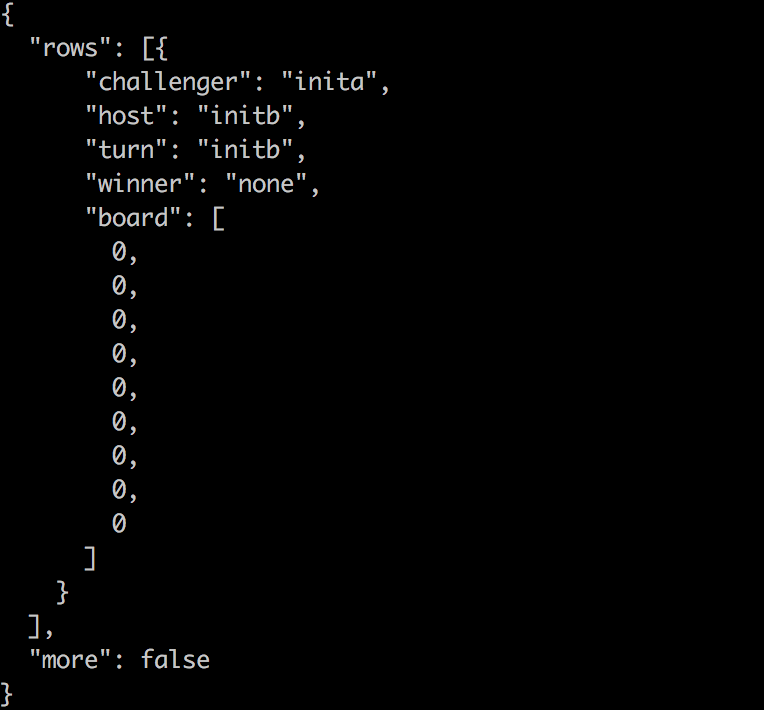
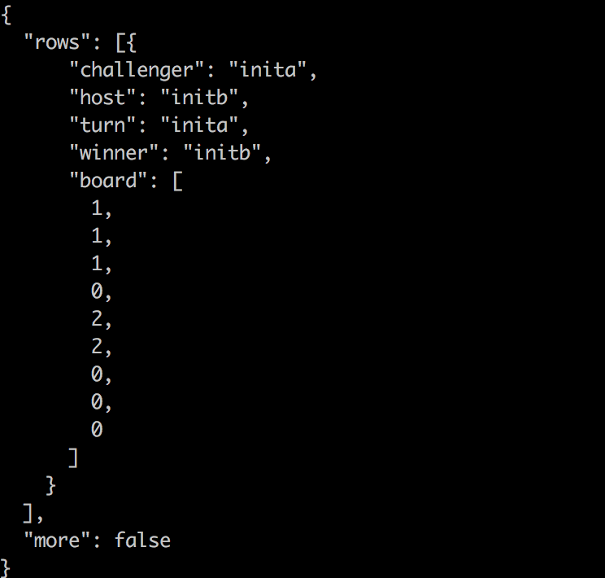

# Tic_Tac_Toe智能合约

<br>
通过玩三连棋游戏，来一步步解读智能合约的开发过程
> 游戏规则：两人轮流在印有九格方盘上谁先把三个同一记号排成横线、直线、斜线, 即是胜者

> 游戏功能： 
> * 新建：创建一个新游戏
> * 重启：重新启动现有游戏，允许主机或挑战者执行此操作
> * 关闭：关闭现有游戏，释放用于存储游戏的存储空间，只允许主机执行此操作
> * 移动：做一个动作

> 执行环境： 
> * EOS版本：Dawn 4.0.0及以上
> * EOSJS版本：Dawn4及以上
---
## 1.开发概述
创建tic_tac_toe.hpp，该头文件主要声明了1个结构体，里面包含了5个私有成员，以及2个公有函数，还有4个公有结构体，具体实现参考EOS-Dapp项目里[tic_tac_toe.hpp](https://github.com/PeterHuZQ/EOS-Dapp/blob/master/contract/tictactoe/tic_tac_toe.hpp)文件
，下面简单贴一下源码：

### 1.1 定义结构体
> mkdir tic_tac_toe <br/>
cd tic_tac_toe <br/>
vi tic_tac_toe.hpp


```
#include <eosiolib/eosio.hpp>

using namespace eosio;
namespace tic_tac_toe {
   static const account_name games_account = N(games);
   static const account_name code_account = N(tic.tac.toe);
   
}
```

N函数简单介绍一下，它的源码如下：

```
 /**
  * @brief 用来生成一个编译时间，它是64位无符号整型。
  *        传入的参数X是一个base32编码的字符串的解释。
  * @ingroup types
  */
  #define N(X) ::eosio::string_to_name(#X)
```
### 1.2 定义数据表
#### 1.2.1 Games 数据表
我们需要有一个存储游戏列表的表格，定义一个 games 表

```
namespace tic_tac_toe {
    ...
    typedef eosio::multi_index<games_account, game> games;
}
```

`eosio::multi_index`这里再简单介绍一下,它的模板定义如下,泛型中第一个参数是表名，第二个是多重索引。<br>
`template<uint64_t TableName, typename T, typename...Indices>`<br>

#### 1.2.2 Game 结构体
```
namespace tic_tac_toe {
    ...
    static const uint32_t board_len = 9;
    struct game {
      game() {}
      game(account_name challenger, account_name host):challenger(challenger), host(host), turn(host) {
         // 初始化游戏板
         initialize_board();
      }
      // challenger的账户名，也是表中的key
      account_name challenger;
      // host的账户名
      account_name host;
      // 轮到谁走, 可能是host或challenger的账户名
      account_name turn; 
      // 赢家, 空或平手或者是host或challenger的账户名
      account_name winner = N(none);
      uint8_t  board[board_len];

      // 初始化游戏
      void initialize_board() {
         for (uint8_t i = 0; i < board_len ; i++) {
            board[i] = 0;
         }
      }

      // 重新开始游戏
      void reset_game() {
         initialize_board();
         turn = host;
         winner = N(none);
      }
      // 通过primary_key访问key
      auto primary_key() const { return challenger; }

      EOSLIB_SERIALIZE( game, (challenger)(host)(turn)(winner)(board) )
   };
}
```

### 1.3 定义功能抽象接口
#### 1.3.1 新建
```
namespace tic_tac_toe {
   ...
   struct create {
      account_name   challenger;
      account_name   host;

      EOSLIB_SERIALIZE( create, (challenger)(host) )
   };
   ...
}

```
要创建游戏，我们需要主机帐户名称和挑战者的帐户名称。EOSLIB_SERIALIZE宏提供序列化和反序列化方法，以便可以在合约和nodeos系统之间来回传递操作。

#### 1.3.2 重启
```
namespace tic_tac_toe {
   ...
   struct restart {
      account_name   challenger;
      account_name   host;
      account_name   by;

      EOSLIB_SERIALIZE( restart, (challenger)(host)(by) )
   };
   ...
}

```
要重新开始游戏，我们需要主持人帐户名称和挑战者的帐户名称来识别游戏。此外，我们需要指定谁想要重新启动游戏，因此我们可以验证提供的正确的签名。

#### 1.3.3 关闭
```
namespace tic_tac_toe {
   ...
   struct close {
      account_name   challenger;
      account_name   host;

      EOSLIB_SERIALIZE( close, (challenger)(host) )
   };
   ...
}

```
要关闭游戏，我们需要主持人帐户名称和挑战者的帐户名称来识别游戏。

#### 1.3.4 移动
```
namespace tic_tac_toe {
   ...
   struct movement {
      uint32_t    row;
      uint32_t    column;

      EOSLIB_SERIALIZE( movement, (row)(column) )
   };

   struct move {
      account_name   challenger;
      account_name   host;
      account_name   by; 
      movement       mvt;

      EOSLIB_SERIALIZE( move, (challenger)(host)(by)(mvt) )
   };
   ...
}

```
要进行移动，我们需要主持人帐户名称和挑战者的帐户名称来识别游戏。此外，我们需要指定由谁来做这个动作和他正在做的动作。

### 1.3 主程序
新建 tic_tac_toe.cpp，该源文件中实现了以上tic_tac_toe.hpp头文件中定义的所有公有方法，具体实现参考EOS-Dapp项目里[tic_tac_toe.cpp](https://github.com/PeterHuZQ/EOS-Dapp/blob/master/contract/tictactoe/tic_tac_toe.cpp)文件，下面简单贴一下源码：

> vi tic_tac_toe.cpp

```
#include "tic_tac_toe.hpp"
using namespace eosio;

namespace tic_tac_toe {
    struct impl {
        ...
        //apply方法实现对这个契约的事件分派
        void apply( uint64_t receiver, uint64_t code, uint64_t action ) {
            if (code == code_account) {
                if (action == N(create)) {
                    impl::on(eosio::unpack_action_data<tic_tac_toe::create>());
                } else if (action == N(restart)) {
                    impl::on(eosio::unpack_action_data<tic_tac_toe::restart>());
                } else if (action == N(close)) {
                    impl::on(eosio::unpack_action_data<tic_tac_toe::close>());
                } else if (action == N(move)) {
                    impl::on(eosio::unpack_action_data<tic_tac_toe::move>());
                }
            }
        }
    };
}

...
extern "C" {
   using namespace tic_tac_toe;
   void apply( uint64_t receiver, uint64_t code, uint64_t action ) {
      impl().apply(receiver, code, action);
   }
} // extern "C"
```

添加一个impl结构，其中包含重载的'on'方法，其中采用了不同的操作类型。

### 1.4 编写abi
首先用 cd 命令访问我们cpp文件所在的目录<br>
`cd eos-dapp/contract/tictactoe`
>* 然后再通过以下命令编译出 abi 文件：<br>
`eosiocpp -g tic_tac_toe.abi tic_tac_toe.cpp`

打开tic_tac_toe.abi，定义代码，具体定义参考EOS-Dapp项目里[tic_tac_toe.abi](https://github.com/PeterHuZQ/EOS-Dapp/blob/master/contract/tictactoe/tic_tac_toe.abi)文件


## 2.智能合约的加载与运行
### 2.1编译智能合约
首先用 cd 命令访问我们cpp文件所在的目录<br>
`cd eos-dapp/contract/tictactoe`
>* 然后先通过以下命令编译出 wast 文件：<br>
`eosiocpp -o tic_tac_toe.wast tic_tac_toe.cpp`<br>
会有 warning ，不过如果没有 error 我们就不用去理它。

### 2.2 部署到本地网络
解锁钱包<br>
`cd eos/build/programs/cleos`
> * ./cleos wallet unlock -n default

创建账户<br>
> * ./cleos create account eosio tic.tac.toe [ 生成的公钥 ] [ 生成的公钥 ]
> * ./cleos create account eosio inita [ 生成的公钥 ] [ 生成的公钥 ]
> * ./cleos create account eosio initb [ 生成的公钥 ] [ 生成的公钥 ]

加载合约<br>
执行如下命令，让 tic.tac.toe 账户加载 tic_tac_toe 合约。<br>
`./cleos set contract tic.tac.toe ../tictactoe`

## 3.游戏开始
游戏开始，GO！<br>
> * 首先，我们先来创建棋局，initb是东道主，inita是挑战者,创建棋局需要东道主的授权（–permission initb@active）<br>
`cleos push action tic.tac.toe create '["challenger":"inita", "host":"initb"]' -permission initb@active`



> * 现在开始下棋，东道主先下（比如东道主先在0行0列落子）<br>
`cleos push action tic.tac.toe move '{"challenger":"inita", "host":"initb", "by":"initb", "mvt":{"row":0, "column":0} }' --permission initb@active`<br>
> * 现在轮到挑战者落子：<br>
`cleos push action tic.tac.toe move '{"challenger":"inita", "host":"initb", "by":"inita", "mvt":{"row":1, "column":1} }' --permission inita@active`<br>
> * 为了演示的简单，我们设定东道主第一行从左往右落子，挑战者从第二行第二列开始从左往右下落子，那最终结果就是东道主胜利。<br>
东道主：<br>
`cleos push action tic.tac.toe move '{"challenger":"inita", "host":"initb", "by":"initb", "mvt":{"row":0, "column":1} }' --permission initb@active`<br>
挑战者：<br>
`cleos push action tic.tac.toe move '{"challenger":"inita", "host":"initb", "by":"inita", "mvt":{"row":1, "column":2} }' --permission inita@active`<br>
东道主：<br>
`cleos push action tic.tac.toe move '{"challenger":"inita", "host":"initb", "by":"initb", "mvt":{"row":0, "column":2} }' --permission initb@active`<br>

> * 查看游戏的结果<br>
`cleos get table tic.tac.toe initb games`



> * 重启游戏<br>
`cleos push action tic.tac.toe restart '{"challenger":"inita", "host":"initb", "by":"initb"}' --permission initb@active `

> * 关闭游戏<br>
`cleos push action tic.tac.toe close '{"challenger":"inita", "host":"initb"}' --permission initb@active`

## 4.前端测试
在这里我们就节省读者的时间，不在文章中深究 React.js 的代码了，不过我强烈推荐大家去看下这个例子的代码仓库的frontend文件夹，里面有前端部分的全部代码： 
https://github.com/PeterHuZQ/EOS-Dapp


如果你希望跟我更深入地学习基于EOS的Dapp开发，欢迎添加我的微信：hu350410796


