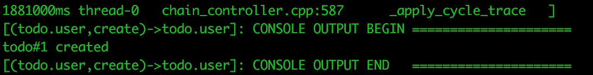
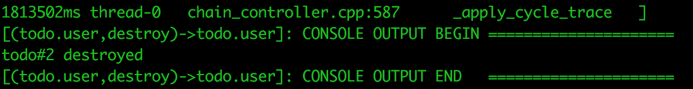
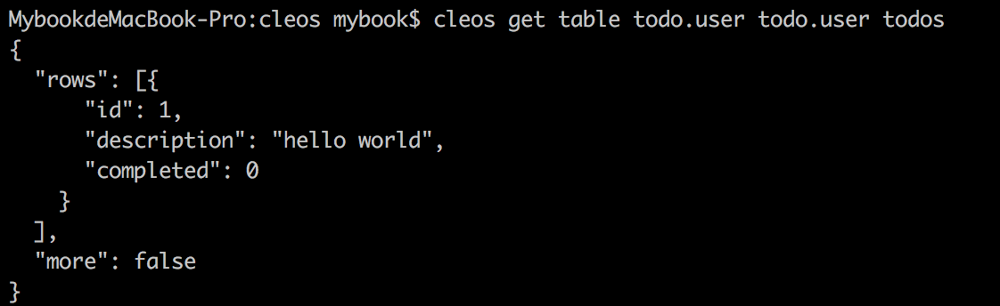

# todo智能合约
---
## 1.智能合约加载与运行
### 1.1 编译智能合约

首先用 cd 命令访问我们cpp文件所在的目录 
`cd eos-dapp/contract/todo`
>* 然后先通过以下命令编译出 wast 文件： 
`eosiocpp -o todo.wast todo.cpp` 
会有 warning ，不过如果没有 error 我们就不用去理它。

>* 然后再通过以下命令编译出 abi 文件： 
`eosiocpp -g todo.abi todo.cpp`

### 1.2 部署到本地网络
清空上一篇教程产生的区块和钱包数据，删除data文件夹里的文件 
`cd /Users/mybook/Library/Application Support/eosio/nodeos/data`

创建钱包 
`cd /eos/build/programs/cleos`
`./cleos wallet create`

加载bios合约
`cd eos/build/programs/cleos`
`./cleos set contract eosio ../../contracts/eosio.bios -p eosio`

创建账户 
`cd eos/build/programs/cleos`
> * ./cleos create key
> * ./cleos wallet import [ 生成的私钥 ]
> * ./cleos create account eosio todo [ 生成的公钥 ] [ 生成的公钥 ]
> * ./cleos create account eosio todo.user [ 生成的公钥 ] [ 生成的公钥 ]

加载todo合约 
执行如下命令，让 todo.user 账户加载 todo 合约, -p todo.user 表示使用权限。 
`./cleos set contract todo.user ../todo -p todo.user`

### 1.3 测试执行智能合约
新增 
`cleos push action todo.user create '["todo", 1, "hello world"]' -p todo` 

删除 
`cleos push action todo.user destroy '["todo", 1]' -p todo` 

查询 
`cleos get table todo.user todo.user todos` 
